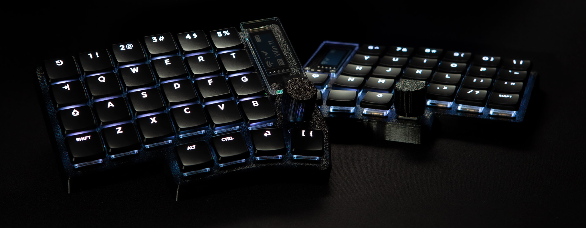

# Build Guide
Leeloo is available in two different form factors and may be configured in many ways.  Within this documentation, you'll find a base build guide, which will take you through the process of building Leeloo.

Leeloo v2.1 and Leeloo-Micro v1.1 have been revised to be more consistent with each other.  Albeit, their circuitry and components have changed, their shape and dimensions have not.

> **WHAT CHANGED?**
> 1. Mill-Max Receptacles were used for socketing nice!view and OLED Displays.
>
>    To simplify, Mill-Max Pins are soldered to the PCB and serve as the male component to the SIP socket that is soldered to the nice!view or OLED Display.
>
> 2. Circuitry was added to support the [Experimental: Automatic power domain handling for displays/RGB](https://github.com/zmkfirmware/zmk/pull/1775) branch currently in draft by **Pete Johanson**.
>
>       Added two components: MOSFET and Resistor, along with a Solderable Bypass Jumper, which can be used if RGB LEDs are not installed.
>
>       **NOTE** \
>       As of Nov 6, 2023, a firmware programming adjustment is required to ensure power management is executing properly.  There have been scenarios where power has been leaking slowly, causing faster consumption of the battery capacity than expected.
>
>       As of Oct 21, 2023, nice!view Displays are supported; huge thanks to Pete Johanson for all his work and effort to update the drivers to support memory in pixel displays.
>
>       The Leeloo and Leeloo-Micro power domain branches will continue to be updated as evolutionary changes are made to the originating experimental fork.  Links will be shared in the **Prepare Firmware** chapter.

## Typical Workflow
Generally speaking, building Leeloo and Leeloo-Micro will be similar:
* [Safety, Tools, and Preparation](chapters/1-Preamble.md)
* [Review Components](chapters/2-Components.md)
* [Prepare Firmware](chapters/3-Prepare-Firmware.md)
    * ZMK | Leeloo and Leeloo-Micro
    * QMK | Leeloo Only
    * Flashing the MCU
* [Cleaning the Shields](chapters/4-Mise-en-place.md)
* [Receptacles](chapters/5-Receptacles.md)
* [Diodes](chapters/6-Diodes.md)
* [RGB LEDs†](chapters/7-RGB-LEDs.md)
* [Hot Swaps](chapters/8-Hot-Swaps.md)
* [MOSFETs and Resistors or Solderable Bypass Jumper†](chapters/9-Bypass-Jumper.md)
* [MCU SIP Sockets and Pins](chapters/10-Microcontrollers.md)
    * Remove MCU
* [Display Pins and SIP Sockets](chapters/11-Displays.md)
* [Reset Switches](chapters/12-Reset-TRRS.md)
* [TRRS Jacks† | Leeloo Only](chapters/12-Reset-TRRS.md)
* [On/off Switches](chapters/13-On-Off-Switches.md)
* [Batteries†](chapters/14-Batteries.md)
* [MCU Installation](chapters/15-MCU-Installation.md)
* [Switches](chapters/16-Switches-Encoders.md)
* [Rotary Encoder(s)†](chapters/16-Switches-Encoders.md)
* [Quality Assurance](chapters/17-Quality-Assurance.md)
* [Bottom Plate](chapters/18-The-Fruit.md)
* [Keycaps](chapters/18-The-Fruit.md)

† Optional steps.

## Do-Re-Mi
Let's start at the very beginning \
A very good place to start \
When you read you begin with A-B-C \
When you sing you begin with do-re-mi.

Next: [Chapter 1: Preamble](chapters/1-Preamble.md) \
Chapters: [Table of Contents](chapters/README.md)

## Feedback
We hope you find this build guide helpful.  If you find an error, or have any recommendations to help make this guide better, please [contact us](https://clicketysplit.ca/pages/contact-us), so we may be able to make the modifications.

Thank you,

Clickety Split  
For the love of split keyboards.
