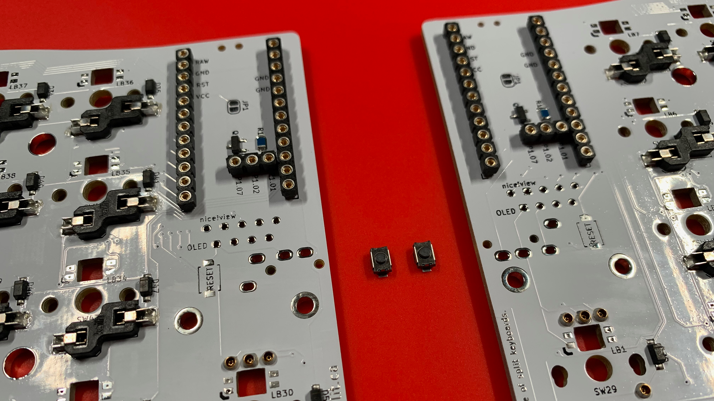
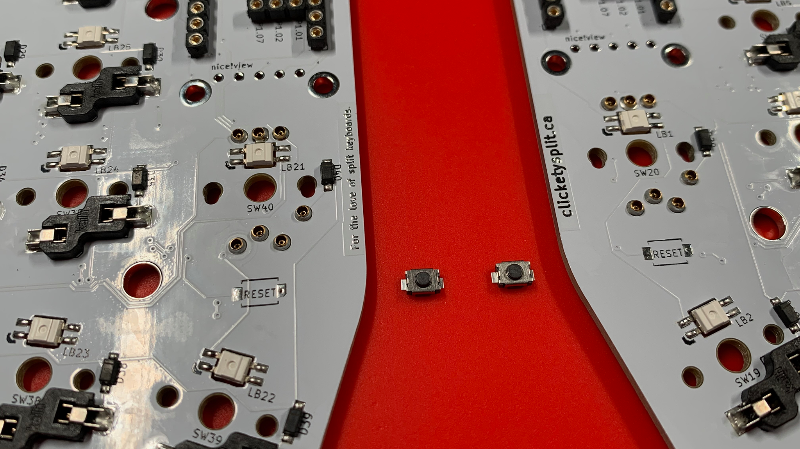
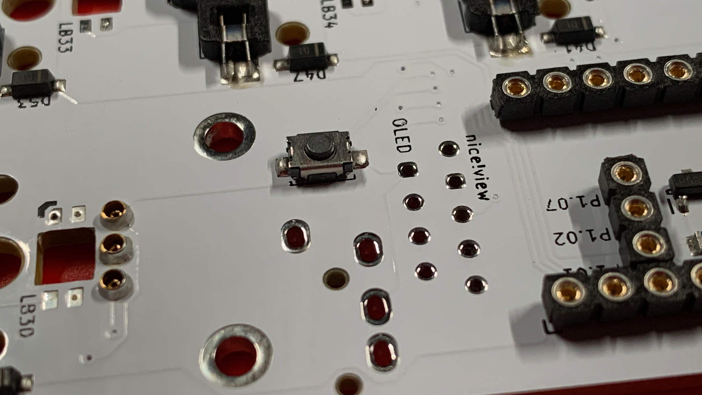
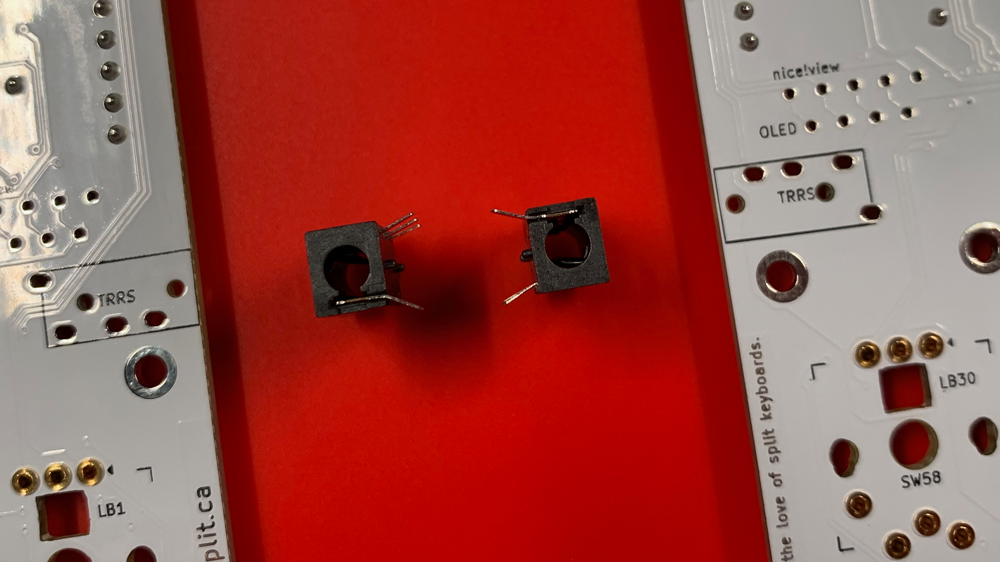
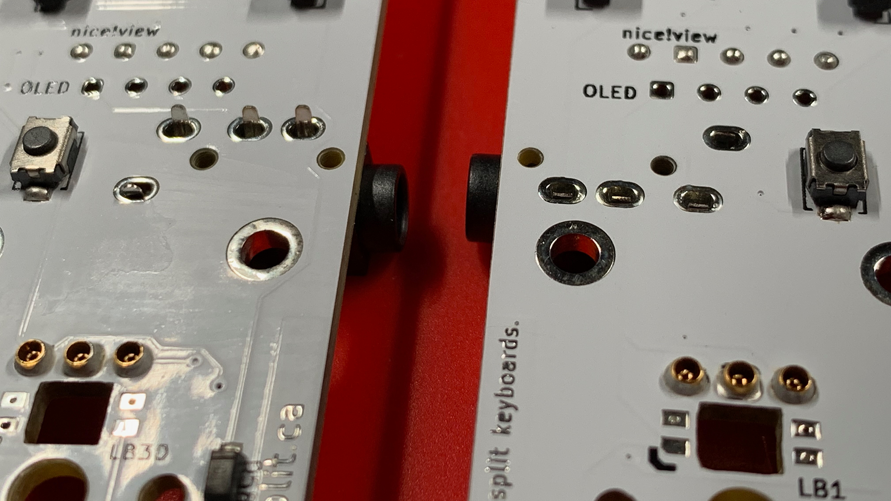

# Reset Switches
With all the soldering you have done, the reset switches will be a piece of cake!

Orientation of the reset switch does not matter.  However, begin the process of soldering by tinning the Reset pad and not the Ground pad.  The ground pad will take more heat, so I would recommend doing the ground pad last.

With the Reset pad tinned, anchor the Reset switch to the pad by warming up the location at the very edge, and when you see the solder liquify, slide the switch into position—centering as best as possible.

The reset switch locations are different for Leeloo and Leeloo-Micro.

### Leeloo

### Leeloo-Micro

> **PLACEMENT TIP** \
> Place the PCB into its appropraite left/right case, and place a switch in each of the 4 corners.
> Place the base of the case in position and see if you have perfect alignment of the reset switch.  The round button of the reset switch should be concentric with the reset button port of the base of the case.

Once you are confident in the switch's alignment, complete the installation by soldering the Ground pad.

> Take a moment to clean each location with 99% IPA and a cotton swab.

# TRRS Jacks
TRRS Jacks are used to join the split halves of Leeloo together with a TRRS cable.

If your implementation of Leeloo is ***wireless*** this step is optional.  Leeloo-Micro does not have TRRS Jacks.

If you plan on leveraging Elite-Pis, or Elite-Cs to give life to Leeloo, then this step is required.

Installation of the TRRS Jacks are straight forward, insert the component and solder the legs.

Yet; I like to do things a bit differently:

* Flare each of the legs out 30°.  This will help keep the component in place.

* Ensure the component is in line with the slikscreen on the top of the PCB.
* Clip the extrusion of the legs off so that each leg is flush to the PCB's through holes.
* Solder each leg.

> Take a moment to clean each location with 99% IPA and a cotton swab.

## Chapters
Next: [Chapter 13: On | Off Switches](13-On-Off-Switches.md) \
Previous: [Chapter 11: Displays](11-Displays.md) \
Chapters: [Table of Contents](README.md) \
Home: [Index](/README.md)
