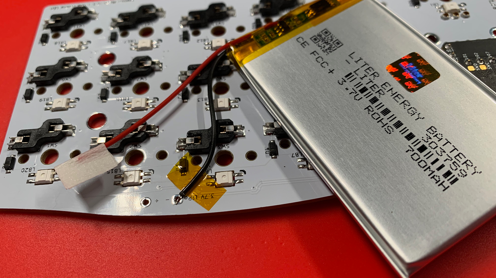
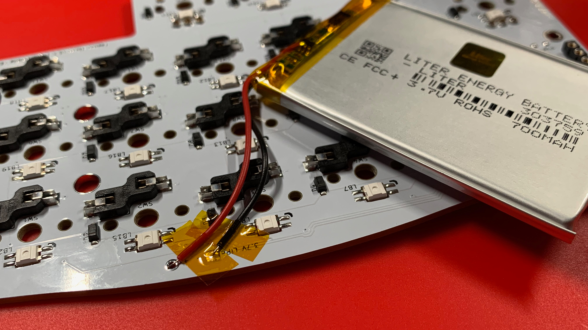
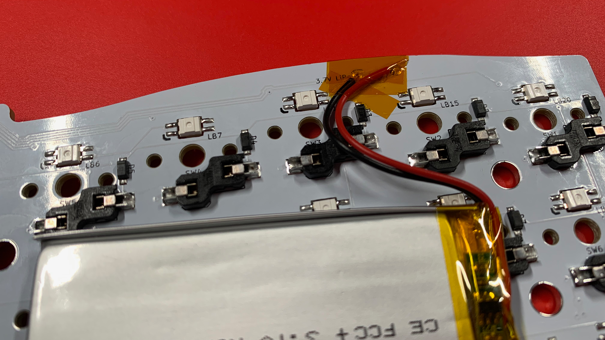

# Batteries
Before installing the batteries, consider obtaining a reading of the batteries themselves.  To verify the reading that was made as part of Clickety Split's QA process when packaging your Leeloo or Leeloo-Micro Kit.

## Testing
With help from a multimeter, select Voltage mode, and ensure that the DC feature has been enabled.

Connect the Black lead from the multimeter to the Black wire of the battery, and the Red lead from the multimeter to the Red wire of the battery.  Do the same for the second battery. Take note of the voltages.

## Prepare Ground
In preparation of soldering the Batteries, you may wish to collect the following items:

* Kapton Tape, 3mm wide
* Hobby knife with a sharp edge.
* Scissors

> **PLANNING THE INSTALLATION** \
> Channel both leads so that they can be as close as possible together and in a way that enables you to tuck the battery into position without a lot of stress on the wires themselves.

> **NOTE** \
> Ensure that the power switches are in the Off Position—toggled to the right.

Place a piece of Kapton tape onto the Black (ground) wire of the battery—as close as possible to the exposed wire to be soldered.

Afix the Black wire in place, with the exposed wire over top of the Negative through-hole pad.  Use your fingernail to bend/flatten the exposed wire as close as possible to the through-hole pad itself.

> **NOTE** \
> The Red wire should still have its protective tape on it.

Solder the lead to the pad.

Place a piece of Kapton tape over top of the soldered location to protect it from shorting with the Red lead, which will be soldered in the next section.

## Prepare Positive Lead
Place a piece of Kapton tape onto the Red (live) wire of the battery—as close as possible to the exposed wire to be soldered.

Afix the Red wire in place, with the exposed wire over top of the Positive through-hole pad.  Use your fingernail to bend/flatten the exposed wire as close as possible to the through-hole pad itself.

Solder the lead to the pad.

## Strain Relief
There should be very little strain on the wires; however, it is best to ensure there is not a lot of stress on the soldered joints.

To do so, carefully peel off the Kapton tape that was used to afix each lead.

Again, channel both leads so that they can be taped as close as possible together and in a way that enables you to tuck the battery into position without a lot of stress on the wires themselves.

Ensure both leads are properly insulated from other metal objects.  And, for extra safety, you can tape the opposite side of the PCB where the battery leads have been soldered.

## Chapters
Next: [Chapter 15: MCU Installation](15-MCU-Installation.md) \
Previous: [Chapter 13: On | Off Switches](13-On-Off-Switches.md) \
Chapters: [Table of Contents](README.md) \
Home: [Index](/README.md)
