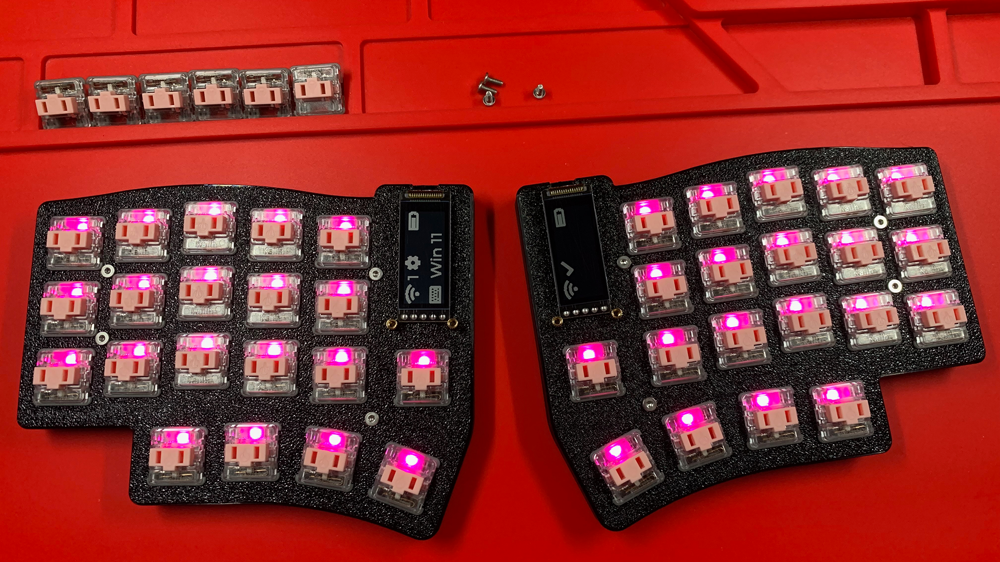
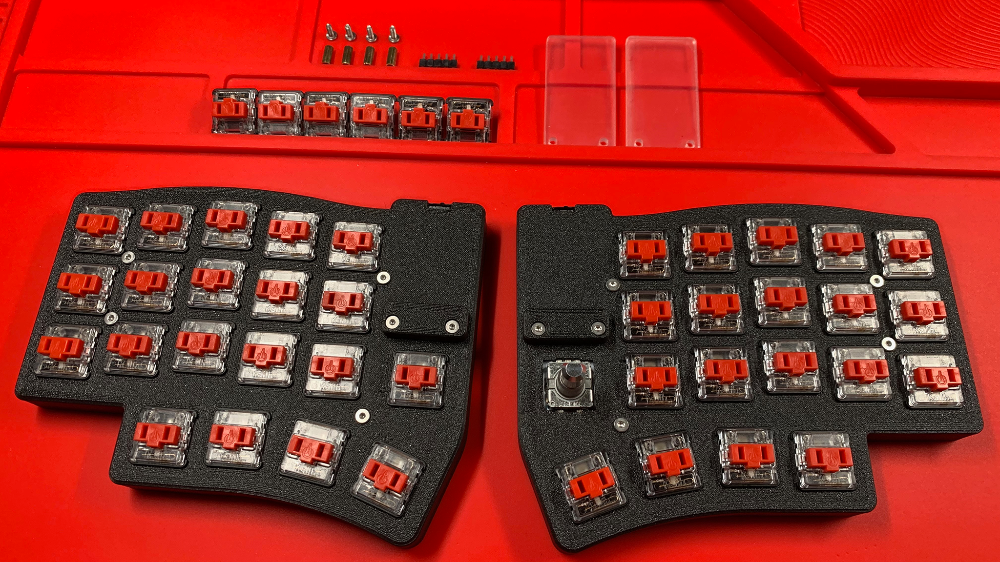

# Switches and Rotary Encoders
Leeloo v2.x and Leeloo-Micro v1.x have 2 switch positions that are hot swappable with rotary encoders.

This may be helpful in situations when you wish to add rotary encoders on the go.

## Switches
Installing switches should be relatively intuitive.  Align the switch leads with the hot swap receptacles and press down evenly.  You may wish to assist the switch into its location by using a small flathead screwdriver to gingerly press the tabs in which retain the switch in position.

> **NOTE** \
> Consider using your thumb to support the hot swap as the switch is being inserted.  I have heard of cases where too much force was used without support from the bottom of the hot swap, and the hot swap popped off with the solder pad attached.

## Rotary Encoders
Rotary encoders are very similar to switches, except that there are 5 leads you need to align with the receptacles.  You may be required to slightly bend the legs of the rotary encoder to align with the receptacles, however, not very much.  Just enough to align the leads so when the rotary encoder is seated into position, the legs do not bend, or fold over.

When removing a rotary encoder, pull straight up.

## Chapters
Next: [Chapter 17: Quality Assurance](17-Quality-Assurance.md) \
Previous: [Chapter 15: MCU Installation](15-MCU-Installation.md) \
Chapters: [Table of Contents](README.md) \
Home: [Index](/README.md)
