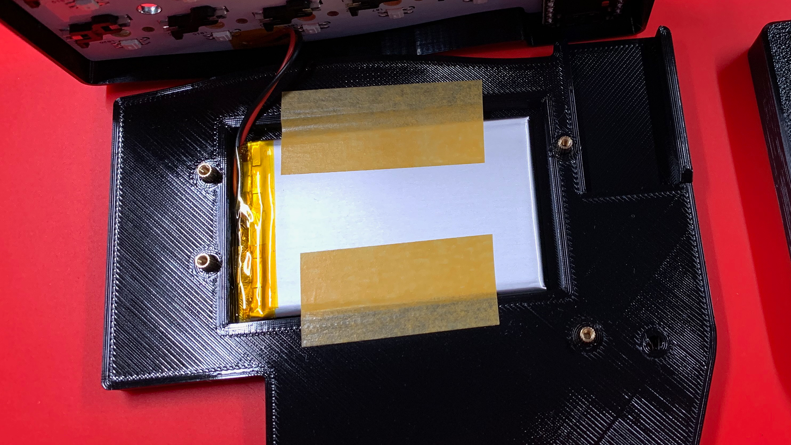
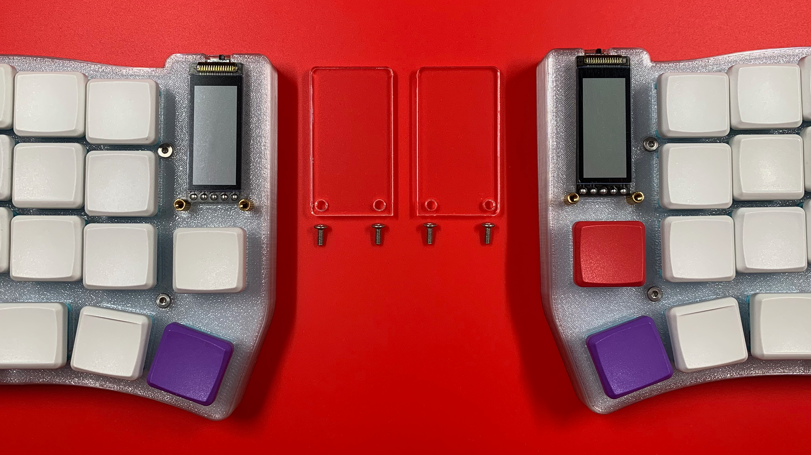
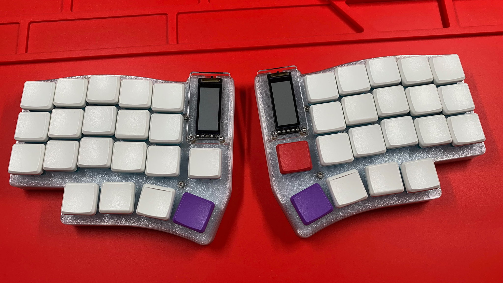

# Enjoying the Fruits of your Labour
You are almost done.  Just a few more steps and your Leeloo or Leeloo-Micro will be complete.

# Bottom Plate
In all likelihood, when you received your kit, the case was already pre-assembled with the brass stand-offs.

If you decided to take the case apart, you may have noticed two lengths for the M2 screws—5mm, and 4mm.  The 5mm screws mount the stand-offs to the base, whereas the 4mm screws attach the case cover to the base, from the top of the case itself.

To complete the bottom plates, consider:
* Placing a bumpon on each each corner of each plate—5 per side.
* Use Kapton tape, or masking tape to afix the battery in place.

* Enclose the completed left|right halves via the remaining 4mm Torx screws.

# Acrylic Covers
### Left and Right Sides
There is a proper direction for each cover.  With the mounting holes towards the bottom, the mounting hole with the 90° corner should be aligned with the case's edge; and, the mounting hole with the rounded corner should be towards the switches—the G and H of a QWERTY keyboard.

   * 4mm Torx Screws mount the 7mm stand-offs from under the PCB.
   * 5mm Torx Screws to mount the acrylic covers.

# Keycaps
Place a keycap onto each switch as per your keymap.  Try to press down as flat and balanced as possible so there is no possibility of breaking one of the keycap legs.

# You did it!
How do you feel?  Did you enjoy the building process?

I'd love to hear all about it, and what's more?  I'd love for you to share pictures of your Leeloo or Leeloo-Micro!

If you have any further questions, please [contact me](https://clicketysplit.ca/pages/contact-us).

:)

Clickety Split \
For the love of split keyboards.

## Chapters
Previous: [Chapter 17: Quality Assurance](17-Quality-Assurance.md) \
Chapters: [Table of Contents](README.md) \
Home: [Index](/README.md)
