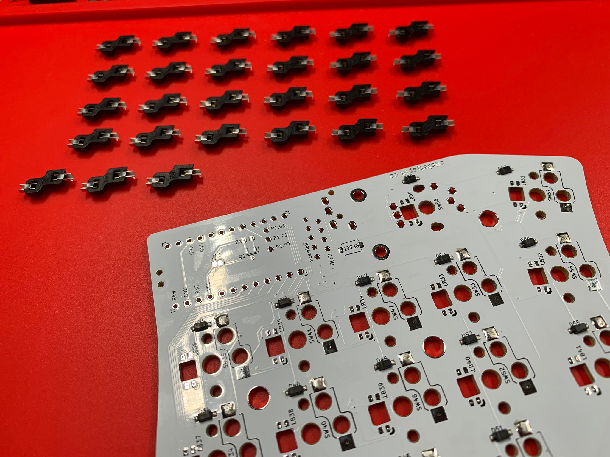
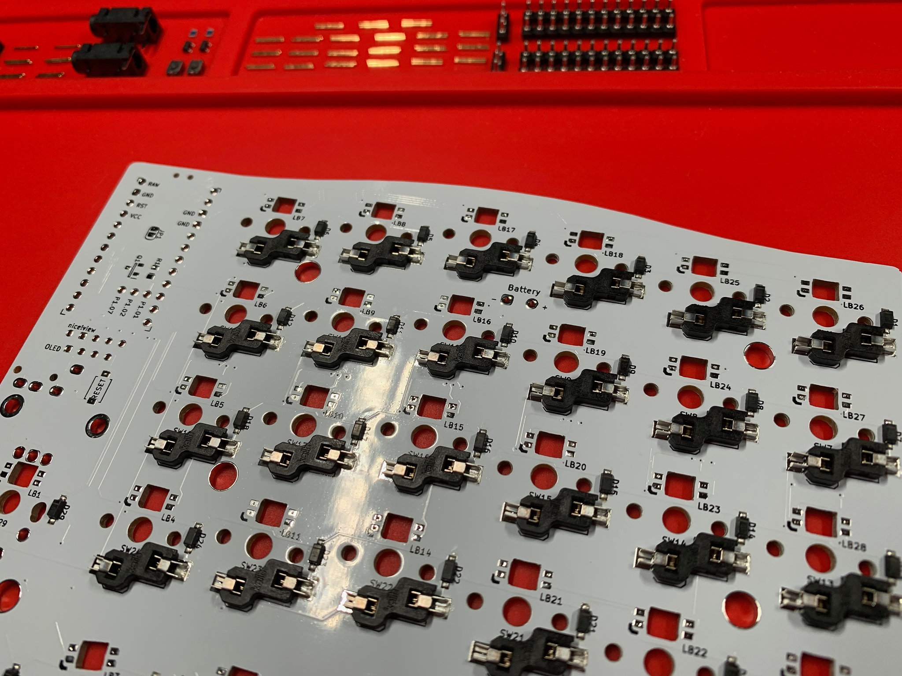
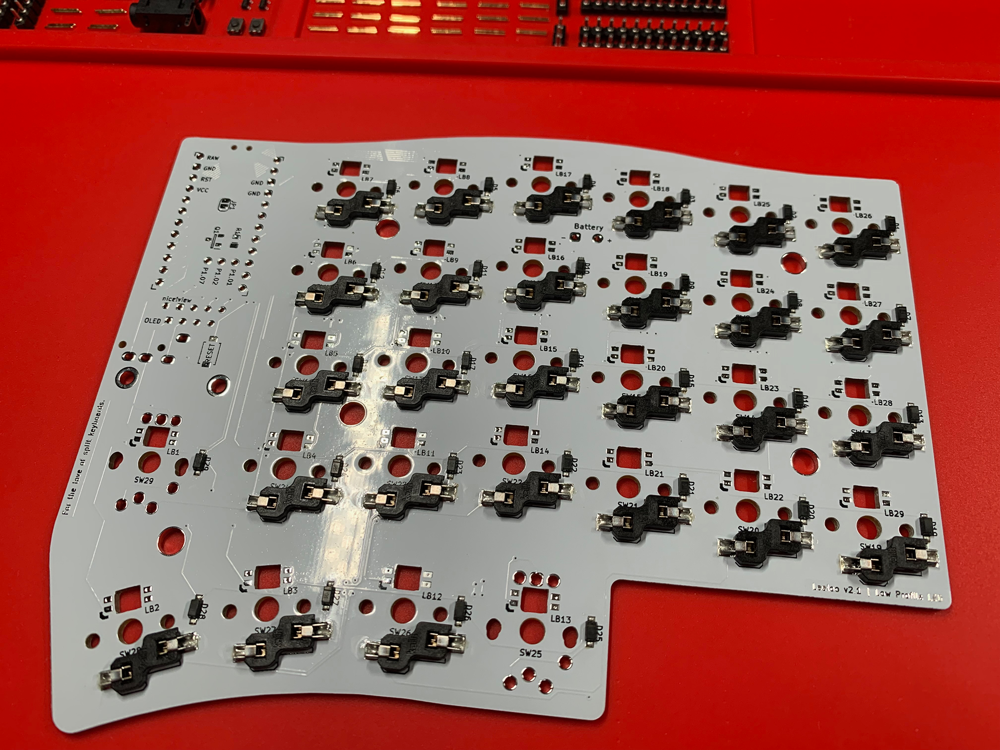

# Hot Swaps
The approach for hot swaps is identical to diodes.  Select a side to tin, and be consistent all the way through each position.  Consider unpacking all that are required, and aligning them as neatly as your OCD will allow.

Once you have selected a particular hot swap SMD pad to begin with, tack on each hot swap.

Then, complete the installation by soldering the remaining SMD pads.

## Choc Hot Swaps
Choc Hot Swaps, on the other hand, have a particular direction.  If you take a close look at an individual hot swap component, and align the Kailh logo so that it reads from right to left, you may notice, at the bottom right, there is a little tab.  You may also notice that if you look at the opposite end, the profile is tapered.  

When soldering the hot swaps, be mindful of these physical characteristics, and align them with the outline silkscreened on the shield itself.

> Take a moment to clean each location with 99% IPA and a cotton swab.

## Box/MX Hot Swaps
Box/MX Hot Swaps are straight forward, they can only be installed one way.

> **NOTE** \
> Leeloo v2.1 with MX Spacing will be in production soon.

## Chapters
Next: [Chapter 9: Bypass Jumper](9-Bypass-Jumper.md) \
Previous: [Chapter 7: RGB LEDs](7-RGB-LEDs.md) \
Chapters: [Table of Contents](README.md) \
Home: [Index](/README.md)
